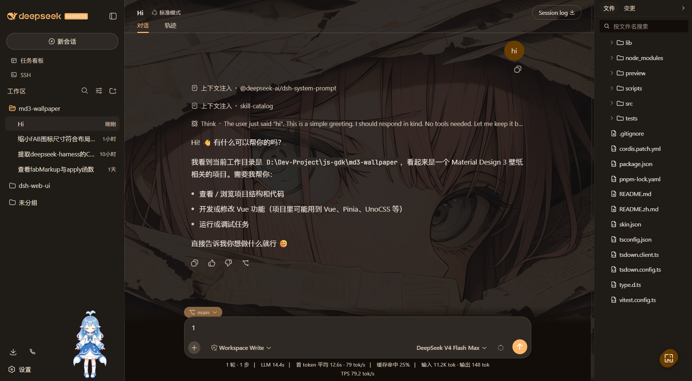
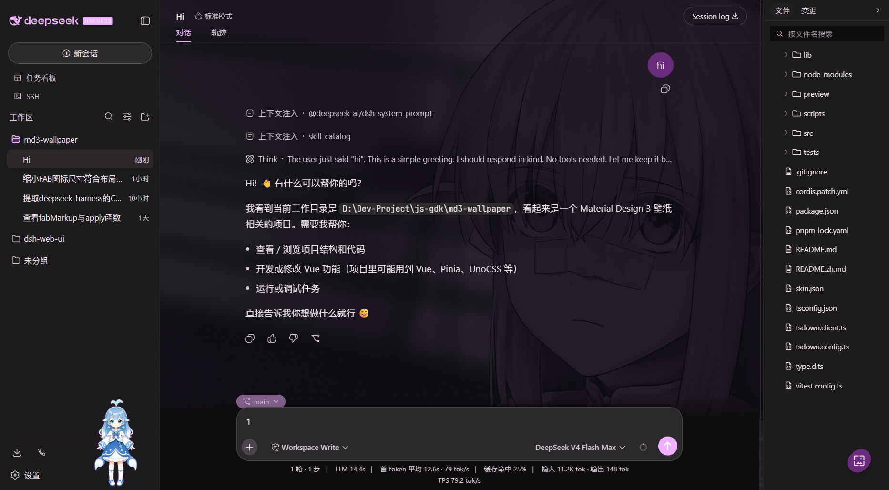

# @AnNingUI/dsh-client-ui-skin-md3-wallpaper

<p align="center">
  <span>English</span> | <a href="./README.zh.md">中文</a> 
</p>




Material You (MD3) dynamic-color skin for the dsh web GUI, as a **standalone
project** — no monorepo, no skin-center registry, no gallery. Clone it
anywhere, build it, install it with one command.

Upload any wallpaper and the skin derives the entire UI palette from it:
Monet's source-color extraction runs through
`@material/material-color-utilities` (Celebi quantization + score ranking),
the M3 light/dark schemes are built from the source hue, and the result is
mapped onto the shell's ENTIRE token surface — all 73 `--dsw-static-*`
tokens (both themes), the hard-coded interaction/scrollbar aliases, and the
standard `--md-sys-color-*` roles. Nothing is left behind: sidebar,
conversation, details, dialogs, menus, scrollbars, status colors and every
currentColor SVG follow the wallpaper; the brand logo is flattened onto the
MD3 primary, the favicon becomes a dot in the Monet source hue, and the
aionui panel surfaces (file tree, git tree, preview) ride the same M3 roles
through the stylesheet's `--aion-*` bridge. While the skin is active the
page is scroll-locked: neither html nor body scrolls in any direction.

It also ships Material You organic chrome: a four-petal blossom FAB (not a
plain circle) whose glyph is the MaterialYouNewTab temperature icon at rest
and morphs — with M3 motion (fade + rotate + scale) — into its clock icon
once the menu opens. The menu offers a **Split Button upload with an
import-effect picker**, restore default, a switch for the M3 shape system,
and a "show wallpaper" toggle (see Features).

The skin is presentation-only: no services are injected, no cordis events
are emitted, nothing reaches a model request. Every write is retracted on
dispose (body attribute, token variables, backdrop, scroll lock, chrome,
favicon, title).

## Features

One thread around the background: upload any wallpaper and the skin extracts
the Monet source color, builds a complete MD3 palette and applies it to the
whole dsh UI; you can choose an **import effect** — **Original** (no
processing, use the image as-is), **MD3 color filter** (default; builds a
filter from the source palette and lightly blends it with the original by
pixel tone, preserving detail) or **Monet unified tone** (tone remap) — from
the arrow on the right of the **Upload wallpaper** button after opening the
wallpaper-settings menu from the FAB in the bottom-right corner, switched any
time and remembered. The pipeline supports **8K full-resolution** pixel
processing at most: pixel work runs in a dedicated worker (Blob-inlined, zero
extra requests), GPU first (WebGPU → WebGL2 fallback, consistent with the CPU
reference), so the UI thread never stalls; the result persists to IndexedDB
and the state to localStorage — a refresh restores it and dispose never drops
the stored wallpaper. You can also enable **show wallpaper** to make the
conversation area transparent and the main panes translucent frosted glass so
the wallpaper shows through.

## Requirements

- Node `^22.19 || >=24`, pnpm.
- A dsh installation (the skin is a standard cordis bundle for the `web`
  profile).

## Build

```sh
pnpm install     # installs @material/material-color-utilities + build tools
pnpm build       # emits lib/index.js (node half) + lib/client.js (bundle)
pnpm test        # vitest: palette mapping + apply/dispose contract + color math
```

> `build` runs `scripts/inline-worker.mjs` after tsdown, inlining the
> standalone worker chunk (`lib/recolor.worker.js`) as a string into
> `lib/client.js` so the browser creates the worker from a Blob URL — do not
> drop this post-build step, or the recolor falls back to the main thread.

## Hot reload while hand-editing the theme

The skin carries a dev watcher: while `pnpm watch` runs (tsdown rebuilds
`lib/client.js` on every save), the skin polls its own served bundle URL
every 2 s, fingerprints the content, and reloads the page the moment the
bundle changed — edit a token, a color or a CSS rule, save, and the GUI
re-applies within seconds. **No dsh restart needed.**

It is on by default. To turn it off:

```js
localStorage.setItem("dsh.md3Wallpaper.devReload", "0"); // then refresh once
```

To turn it back on, delete that key (or set it to `'1'`) and refresh once.
The poll only runs while the page is visible, and the interval is retracted
together with the rest of the skin on dispose.

## Install + activate into a dsh profile

```sh
pnpm install:dsh            # default profile: web
pnpm install:dsh headless   # or any other profile name
```

The script:

1. Links this project into `~/.dsh/profiles/<profile>/node_modules/@AnNingUI/`
   (symlink; junction fallback on Windows);
2. Writes the activation insert row into the **profile's** `cordis.patch.yml`
   — **never** the harness-home `cordis.patch.yml`, which is shared by every
   profile and would break the headless harness.

Then **restart dsh** and open the GUI. The skin applies on the settled page.
Switching skins afterwards is handled by the dsh skin center (it manages the
same profile patch); this project only installs + activates itself.

Alternative manual install (same as any official plugin):

```sh
dsh plugin --profile web add link:<path-to-this-project>
```

## Using the skin

Click the FAB in the bottom-right corner to open the menu:

- **Upload wallpaper (Split Button)** — the main area picks an image; the
  chevron opens the import-effect picker (Original / MD3 color filter /
  Monet unified tone), applied to this and future uploads.
- **Restore default** — back to the M3 baseline seed (#6750A4).
- **M3 shape system** — toggle the Material 3 corner language (persisted).
- **Show wallpaper** — turn on translucent frosted panes (frame transparent)
  so the wallpaper shows through (persisted).

The theme flips live with the shell's dark/light switch: the dark scheme's
inverted tonal mapping is applied immediately.
Recolor runs in a worker: 8K uploads never stall the UI; the result is stored
in IndexedDB and restored after a refresh.

## How the palette is mapped

MD3 has five tonal palettes; the shell has nine color families:

| Shell family     | MD3 palette         | Notes                                         |
| ---------------- | ------------------- | --------------------------------------------- |
| `deepseek`       | primary (a1)        | brand hue                                     |
| `blue`           | secondary (a2)      | auxiliary blue                                |
| `green`          | tertiary (a3)       | success rides the third accent                |
| `amber`          | primary (a1)        | warnings reuse the brand hue at offset tonals |
| `red`            | error               | danger                                        |
| `neutral`        | neutral (n1)        | text/borders/surfaces                         |
| `neutral-bluish` | neutralVariant (n2) | background/surface scale                      |

The shell's numeric suffixes are lightness steps, not M3 tones, so each
suffix maps to an explicit (light, dark) tonal pair; dark inverts lightness.
The M3 surface-container roles are completed from the neutral palette per the
M3 spec tonal tables.

## Model Experience

None. The skin mutates only the browser DOM; nothing here reaches a model
request.

## Known limitations

- The loading page stays stock (the boot page renders before plugin bundles
  exist).
- Code syntax highlighting (the json-tree component) keeps its built-in
  colors (component-root tokens out-scope body variables).
- The persisted compact state is a downscaled JPEG (<= 512px); the backdrop
  itself is the 8K full-precision recolored result (IndexedDB bitmap), so a
  very large monitor keeps full sharpness on the wallpaper.
